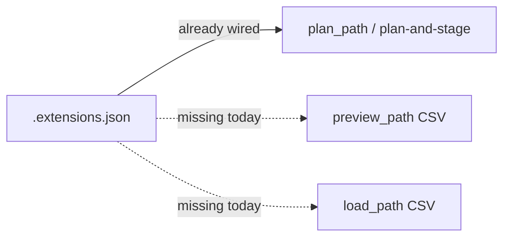

# CSV Extension Preview/Load Parity

## Context

A16 (`2fa1016`) made extensions **configurable** for survey CSVs. `plan_path` / plan-and-stage already honor the sidecar. Two call sites still invent their own engine without extension kwargs:

| Call site | Today | Should match |
|---|---|---|
| [`preview_path`](server/path_manager.py) survey-CSV branch (~910) | `PathEngine(fit_arcs=True, …)` only | DXF preview: passes `enable_path_extensions`, `pre_extension_m`, `aft_extension_m`, `per_line_extensions` from `resolve_extension_settings` |
| [`load_path`](server/path_manager.py) CSV+origin branch (~750) | same bare engine | DXF `load_path` routes through `plan_path` (sidecar-aware) |

Production `load-to-controller` is fine (staged artifact). Gap hits map WYSIWYG and legacy `/api/path/load`.



## Changes

### 1. `preview_path` — survey CSV branch

In [server/path_manager.py](server/path_manager.py) (~902–914), resolve extensions like the DXF branch (~834), then pass them into `PathEngine` alongside existing line-config / arc-fit:

```python
enabled, pre_m, aft_m, per_line = self.resolve_extension_settings(name)
cfg = self.load_line_config(os.path.basename(fpath))
plan = PathEngine(
    fit_arcs=True,
    fit_arcs_max_dev_m=cfg["fit_arcs_max_dev_m"],
    fillet_corners_m=cfg["fillet_corners_m"],
    enable_path_extensions=enabled,
    pre_extension_m=pre_m,
    aft_extension_m=aft_m,
    per_line_extensions=per_line,
).plan_file(fpath)
```

Invalidate preview cache on extension-config save is already done (`_preview_cache.pop` in `save_extension_config`).

### 2. `load_path` — CSV branch with origin / start_position

Around ~743–760: same four extension kwargs (plus existing `fit_arcs` / line config). Prefer routing survey CSVs through `plan_path(...)` like DXF does (~735), so origin / auto_origin / extensions stay one code path — only if that preserves current call semantics; otherwise mirror kwargs on the local `PathEngine`.

Also check the `_load_file` survey-CSV fallback (~1400) if it still builds a bare engine for preview-like consumers; align if it surfaces spray/waypoint geometry.

### 3. Tests in [server/test_path_api.py](server/test_path_api.py)

Mirror the existing DXF parity tests (~2491):

- Save extensions ON (0.5 / 0.5, `per_line=False`) on a small survey CSV.
- Assert `preview_path` waypoint count == `plan_path` / `load_path` count.
- Assert first/last preview spray flags are False (PRE/AFT transit).
- Assert MARK length unchanged vs extensions OFF (deadhead only grows).
- Scope: legacy headerless NED CSV still cannot save extensions (already covered by A16).

Optional: one closed-loop note in test docstring only — do not change `per_line` default; operator chooses chain-ends vs per-line via sidecar.

## Out of scope

- Engine / arc_chain / extension clamp logic
- App `plan-trajectory` densify-only endpoint
- Changing default `enabled: False` or `per_line: True`
- Entity order / overrides (remain DXF-only)

## Verify

Run the new tests plus existing extension / survey-CSV tests in `server/test_path_api.py`.
